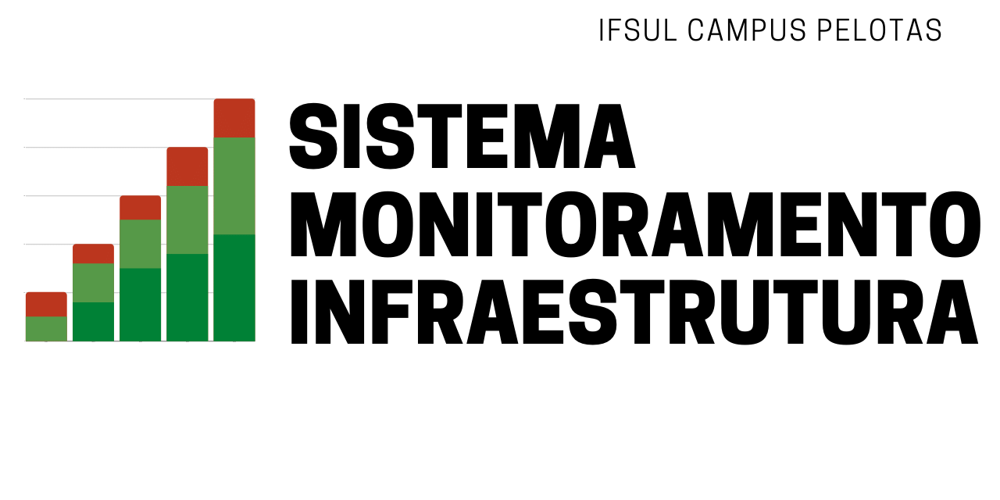

# Monitor Energia IFSul

Sistema de gerenciamento e monitoramento de energia elétrica do IFSul Campus Pelotas.  Projeto dividido em API para controle das informações recolhidas e disponibilizadas,  hardware para medição da qualidade de energia ou interface com equipamentos já disponíveis e Dashboard de visualização e pesquisa no dataset das informações. 

## WEB API

Baseada em **GraphQL**, usa requisição **http** para disponibilizar ou consumir objetos javascript (**JSON**) com as informações aquisitadas. As informações são salvas em um banco de dados PostgreSQL.

